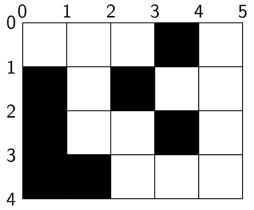
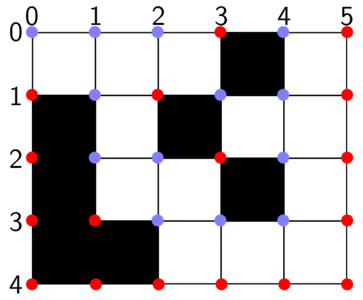
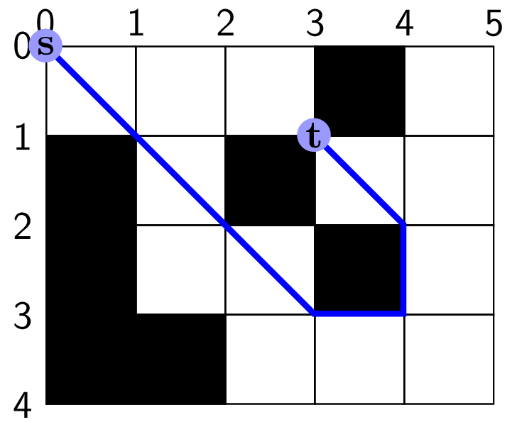
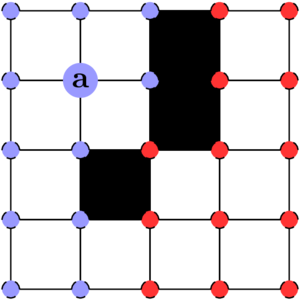
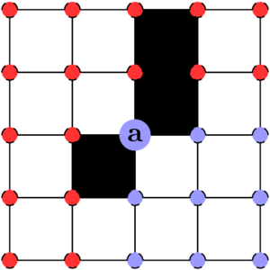
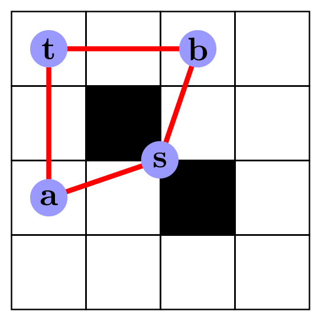

# Problem statement: any-angle setting
Your task is to find a path on a Euclidean plane represented by grid, and the solution is evaluated based on optimality, time performance and space cost.

## From Grid to Euclidean Plane
Input grid format is specified at [MovingAI](https://movingai.com/benchmarks/formats.html).

The grid is mapped to the Euclidean plane, details below:

  1. Euclidean plane `(x,y)` coordinates increases to the right (east) and downards (south) respectively.

  2. Each grid cell maps to the Euclidean plane with their `(x,y)` coordinate coorisponding to the Euclidean plane.

  3. The grid cell `(x,y)` translates to Euclidean plane square `(x,y)` to `(x+1,y+1)`, i.e. a grid coordinate is the top-left corner.

  4. The blocked grid cell squares translates to non-traversable space on the Euclidean plane.

### Example Map
Grid:

    ...#.
    #.#..
    #..#.
    ##...

Euclidean palne:

## Agent

1. agent at `(x, y)` is a point on the Euclidean plane

2. agent start and target positions are the top-left corner of non-blocked grid cell squares. For example, all purple positions in the following plane are valid start and target positions, and all red positions are invalid.
  

     
  

## Path
For a query `(s, t)`, a valid path is a sequence of **Integer Coordinates** `p=(s,v1,...vn,t)`, any two adjacent coordinates `a` and `b` on the path must be a **valid path segment** (see details in the next section).

The following example shows a valid path, `[(0,0), (3,3), (3,4), (2,4), (1,3)]`, for query `[(0,0), (1,3)]`: 
  

     
  

**When start and target are the same position, the path must be empty, the length must be `0`.**

## Valid Path Segments

For any given two adjacent coordinates `a` and `b` in a path, where the agent moves from position `a` to position `b`, the following constraints must be followed in general:
  
The straight line path segment defined by `a` and `b`, must not traverse through:
1. Any blocked grid cell square (non-traversable area), excluding the boundaries and corners of the square.

2. Any boundary that is shared by two adjacent blocked grid cell squares, where multiple adjacent blocked grid cell squares form a large non-traversable area.

3. Any square corner shared by two diagonal adjacent blocked grid cell squares (No Double Corner Cutting).

4. Any boundary of a blocked grid cell square that is also the boundary of the map.

In the following example, path segment `(a, b)` is invalid if `b` is located on red circles, and is valid if `b` is located on purple cicles:
  

    
  

### When `a` is a start position on a double conner

A special case is that `a` is a start position located on a double corner. In this case, the outgoing direction must between `EAST` and  `SOUTH`.

In the following example, path segment `(a, b)` is invalid if `b` is located on red circles, and is valid if `b` is located on purple positions:
  

    
  

### When `b` is a target position on a double conner

Another special case is that `b` is a target position located on a double corner. In this case, the incoming direction must come between `EAST` and  `SOUTH`.

In the following example, path segment `(a, b)` is invalid if `a` is located on red circles, and is valid if `a` is located on purple positions:
  

    
  

