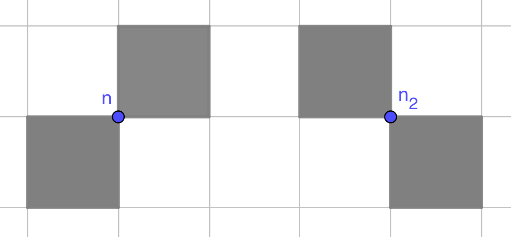
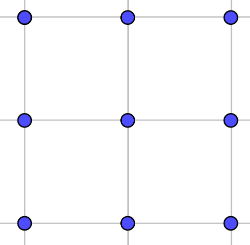
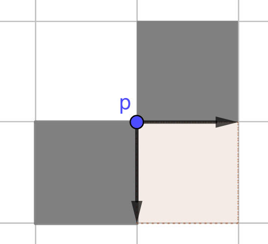

# Grid-Based Path Finding Competition Starter Kit

## TLDR

* Participants push commits to their repositories and the server will pull, compile, run and evaluate the current head of the main branch.

  * participants can add new repo via our web interface 
  * participants must specify their dependency in `apt.txt` (we provide a sample in `startkit`)
  * server will build a docker image to compile, run and evaluate submissions

## About the competition.

The Grid-Based Path Planning Competition (GPPC), begun in 2012, provide a meaningful comparison between many Path Planning approaches that was previously unavilable. 
Individuals and researchers interested in grid-based path planning are encouraged to enter their code into the competition.

## Competition workflow

From this year, the GPPC competition will running continously until a deadline, and submissions are welcome at any time before deadline. 
Participants can submit multiple times before the deadline and their submission will be graded automatically.

## Join the competition

Login the [competition website]() with a github account, and we will automatically create an private github repo for you. 
The repo will be the place that you submit codes to. You can click "My Repo" to open your github repo page.

## Make your first submission

Clone the starter kit, which includes a basic sample implementation. 
```
$ git clone https://github.com/gppc-dev/startkit.git
$ cd startkit
```
Add your competition private repo to the startkit local repo.
```
$ git remote add contest_server git@github.com:your_repo_address
$ git push contest_server
```
Finally click "Evaluate my codes" button on the competition website!

# Problem statement: any-angle setting
Your task is to find a path on a given graph, and the solution is evaluated based on optimality, time performance and space cost.

We use following concept and notations in this document.

* term *location `(x, y)`* means the location in **char-map** from input, (non-traversable: `location(x, y)=0`, traversable: `location(x, y)=1`)
* term *point `(x, y)`* means a point in **euclidean plane**

## Map
Instead of using polygons, the map is represented by characters.

  1. the input map is a `h*w` char map, i.e. the map is represented by `h` row strings, each row has `w` characters;

  2. traversable char (e.g. `.`) at location `(x, y)` (row y, column x) means `[x, x+1] * [y, y+1]` area in euclidean plane is traversable

  3. non-traversable chars (`SWT@O`) at location `(x, y)` means `(x, x+1) * (y, y+1)` area in plane is non-traversable
 

## No Double Corner Cutting

* point `(x, y)` is non-traversable if both diagonal quadrants are non-traversable, e.g.

  * In euclidean plane: 
  * In char-map
    ```
      .#      #.
      #.  or  .#
    ```

## Agent

  1. agent at `(x, y)` is a point on the euclidean plane

  2. agent start and target position is an intersection point  -- the top-left corner of an area that represented by the char-map, 
  and it must be a traversable area, i.e. `location(x, y)=1`

  3. agent cannot pass through double-cutting corner; when agent start or target is a double-cutting corner,
  **the only case is**: 

  * then outgoing / incoming direction must between `EAST` and `SOUTH`, i.e. shifting point `(x, y)` to `(x', y')` in `SOUTHEAST` with a small distance.

**When start and target are same node, the path must be empty, the length must be `0`.**

# Start Kit

For those who using c++ (most of participants), you submission must include following files.

| File name             | Description                                                     | Modifiable |
| --------------------- | --------------------------------------------------------------- | ---------- |
| `main.cpp`            | Define api of executable, compiled to `run`                     | no         |
| `Timer.h`             | Define timer                                                    | no         |
| `Timer.cpp`           | Define timer                                                    | no         |
| `ScenarioLoader.h`    | GPPC scenario file parser & loader                              | no         |
| `ScenarioLoader.cpp`  | GPPC scenario file parser & loader                              | no         |
| `GPPC.h`              | Common used code for GPPC                                       | no         |
| `Entry.h`             | Define functions prototypes that will be used by `main.cpp`     | no         |
| `Entry.cpp`           | Implementations                                                 | yes        |
| `compile.sh`          | Compile your code to executable `run`                           | yes        |
| `apt.txt`             | Define dependency, will be used by server to build docker image | yes        |
| `Dockerfile`          | Define docker image, will be used by server                     | no         |

besides, you will have following generated files

| File name     | Description                                                           | Optional |
| ------------- | --------------------------------------------------------------------- | -------- |
| `run`         | compiled executable, will be called in evaluation                     | no       |
| `run.stdout`  | stdout is redirected to here                                          | no       |
| `run.stderr`  | stderr id redirected to here                                          | no       |
| `run.info`    | stores some run time information                                      | no       |
| `result.csv`  | stores query information, including time cost, path length, etc.      | no       |
| `index_data/` | if your algorithm has precomputation, all produced data must be here  | yes      |

We provide `Theta*` in c++ as an example.

For those who using other languages, you may not need to include `*.cpp` and `*.h` files in above table, but others are still required.
Notice that `run` is a untracked file by default (see in `.gitignore`), if you put code in this file, make sure you also modify the `.gitignore`.

# Details on the server side

For those who **want to build local testing workflow** or **not using c/c++**, this section might be helpful.

## I/O Setup

* All `stdout` from program are redirected to a file `run.stdout`

* All `stderr` are redirected to a file `run.stderr`

* The results of benchmark (i.e. `./${exec} -run <map> <scen>`) are written to `result.csv`

* All these files are in docker, and will backup to server so that we can hide/reveal information to participants.

## Execution Setup

* The server run all scripts under certain constraints, e.g. time limit, memory limit.

* A execution will be killed by server when it exceeds limits, and participants will get `Time Limit Exceed` / `Memory Limit Exceed` verdict.

* If a execution crashed, participants will get `Run Time Error` verdict with few or none hints.

* Participants can submit their solution and execute in `dev` mode for testing purpose, in `dev` mode:
  * we only test a small set of simple map
  * we will reveal all `stdout` and `stderr` to participants
  * this mode is to eliminate compile errors and illegal output format.
  * although participants can do this locally, we encourage everyone to submit on `dev` mode at least once.


## Evaluation Workflow

### Overview
1. Build docker image based on Dockerfile in submission repo.
2. Start the container in background.
3. Run pre-processing for debug maps.
4. Run validation for debug scenarios.
5. Run pre-processing for benchmark maps.
6. Run validation for benchmark scenarios.
7. Run benchmark for benchmark scenarios.
8. Submit final result.


### Details

* Setting up environment: 
  * The docker image working directory should be set to the directory where executables are.
  * `docker build -t <image name> <dockerfile>`: build docker image based on a default/user-defined dockerfile.
  * Building executable:
    * The dockerfile include a RUN command that running a user provided compile script `./compile.sh` to build executable.
  * `docker run -d --name <container name> <image name> ...`: start the container in background


* All following commands are running in docker, and have prefix: `docker container exec <container name>`

* Running preprocessing:
  * `<prefix> ./run -pre ${map_path} none`: run user provided preprocessing script
  * To discuss: user can read none/part/full outputs?

* Running executable with validator
  * `<prefix> ./run -check ${map_path} ${scenario_path} `
  * if the execution not failed, we will send output to our `validator`, otherwise see in [Execution Setup](##execution-setup)
  * the `validator` read from `stdout` file and show verdict message to participants
  * `validator` produces 3 types of verdicts: 
    * `correct`: all paths are valid and lengths are optimal
    * `suboptimal`: all paths are valid, but lengths may not optimal
    * `wrong answer`: there are invalid paths

* Running executable for benchmarking: `<prefix> ./run -run ${map_path} ${scenario_path}`
  * we will track time/memory usage and publish results
